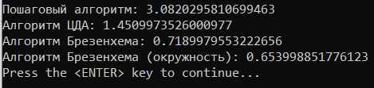
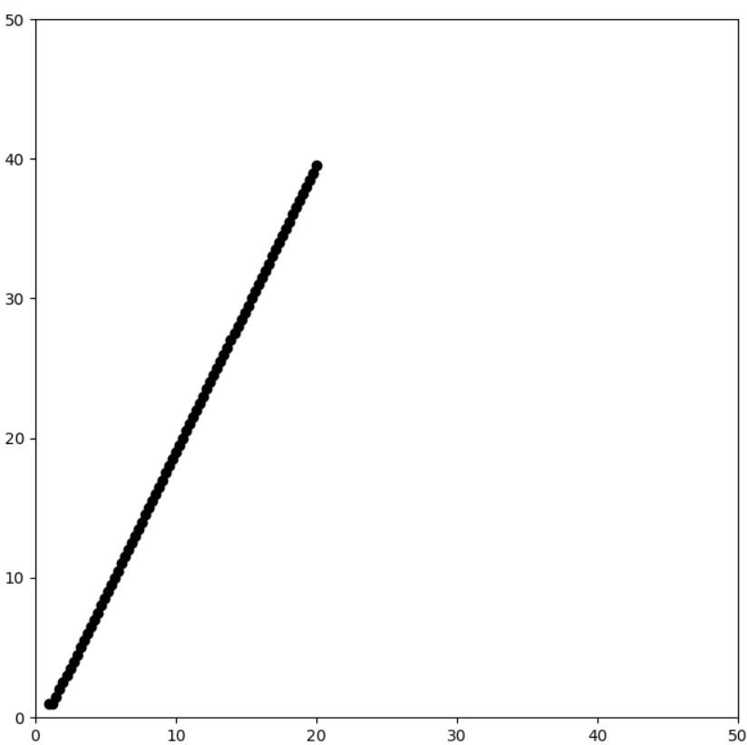
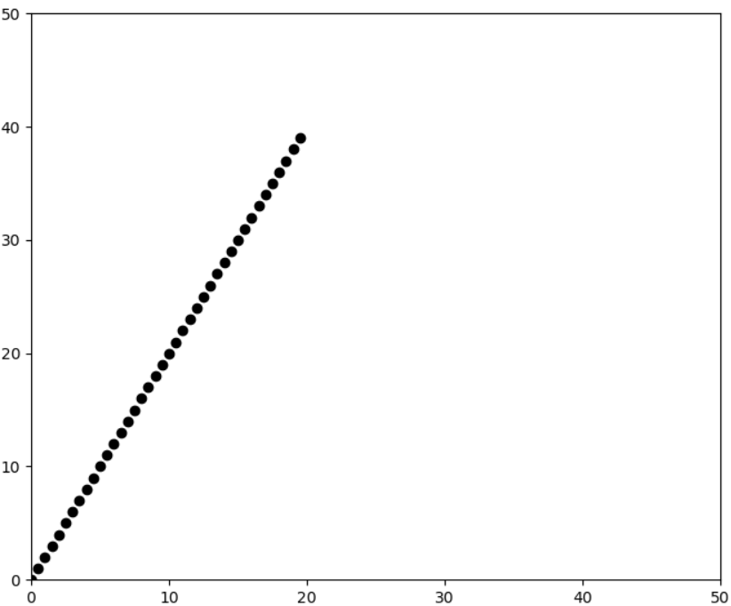
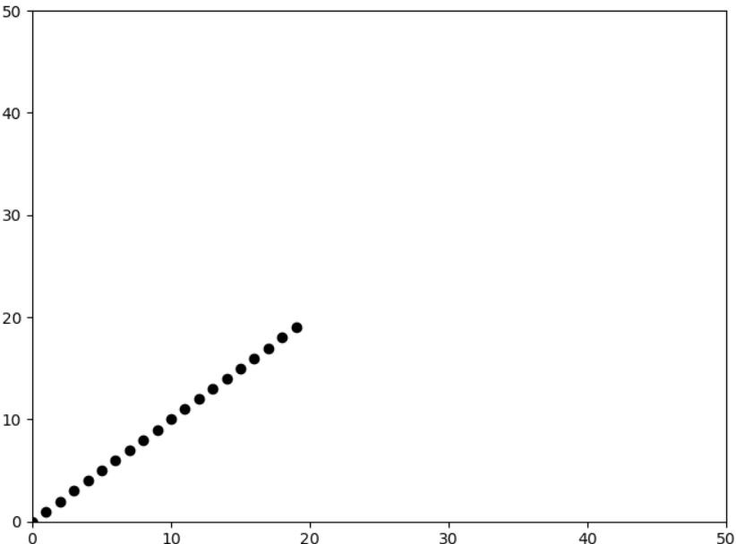
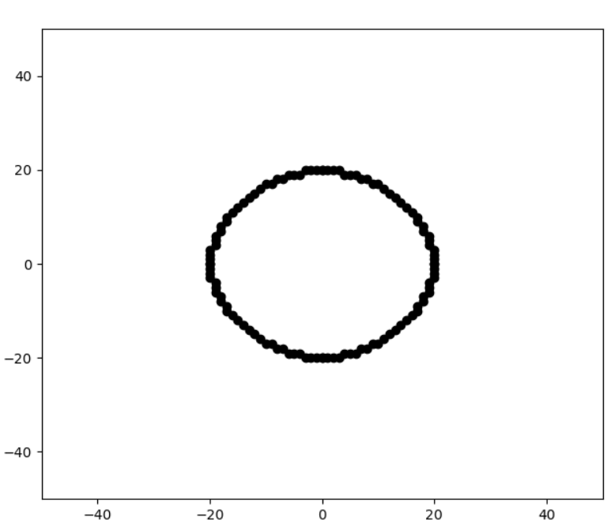

## Task

Write an application / web application that illustrates the operation of basic raster algorithms (4 algorithms).

## Result

Linear Bresenham's algorithm is the fastest

Figure 1

Figure 2

Figure 3

Figure 4

## Requirements

* win10 latest version

## Installation and usage

Run lab4.exe
