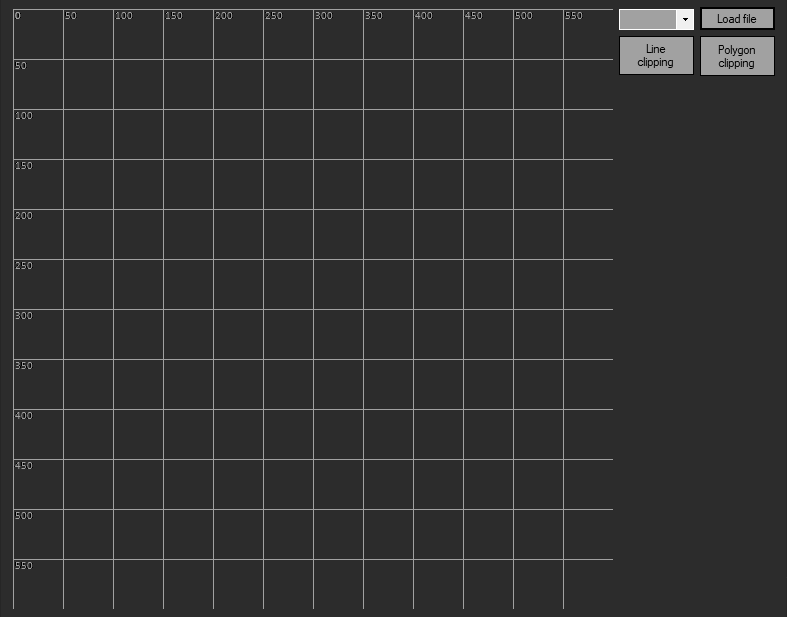
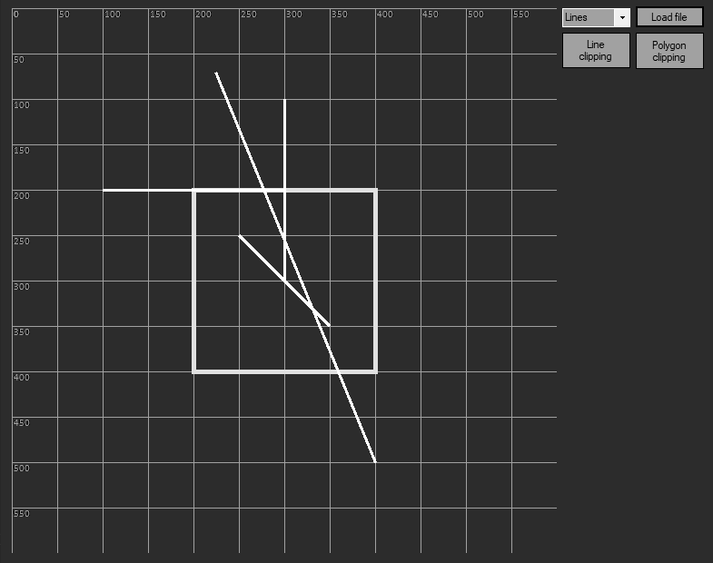
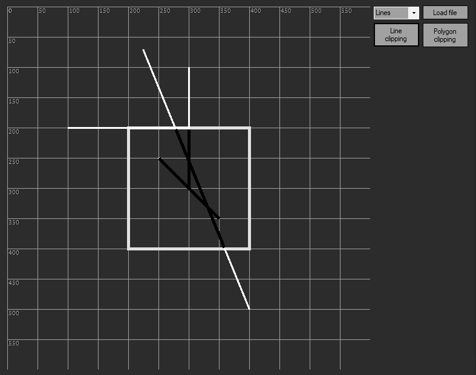
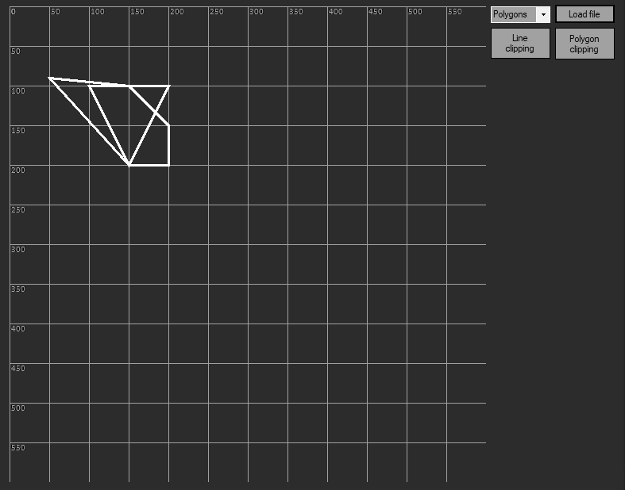
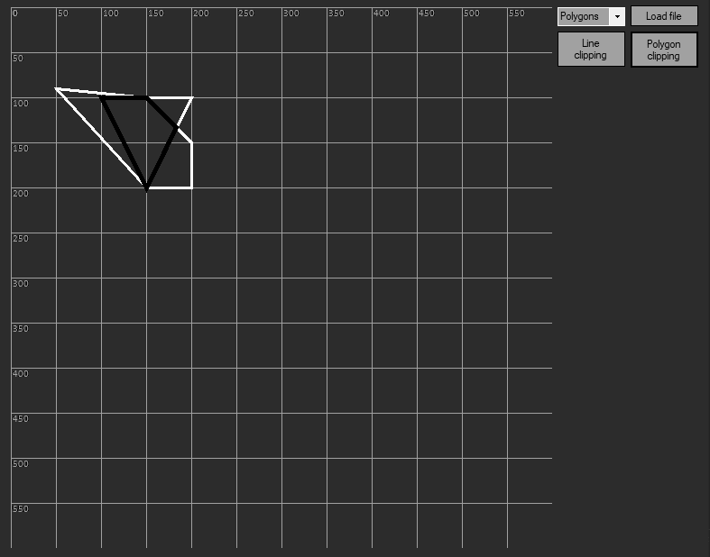

# KG5
lab5

## Task

Write an application / web application that illustrates the work of algorithms for cutting line segments and polygons.

## Initial

## Midpoint algorithm

## Sutherland–Hodgman algorithm

## the requirements
* win10 latest versionr
* .NET Framework 4.7 or later

## Installation and usage

Run lab5.exe
